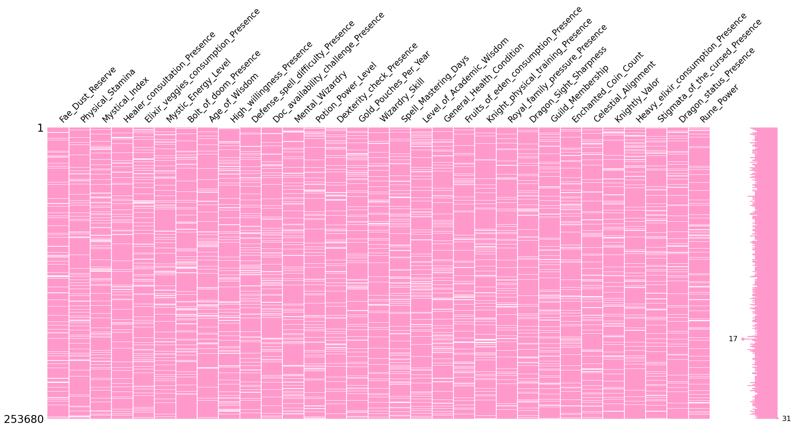
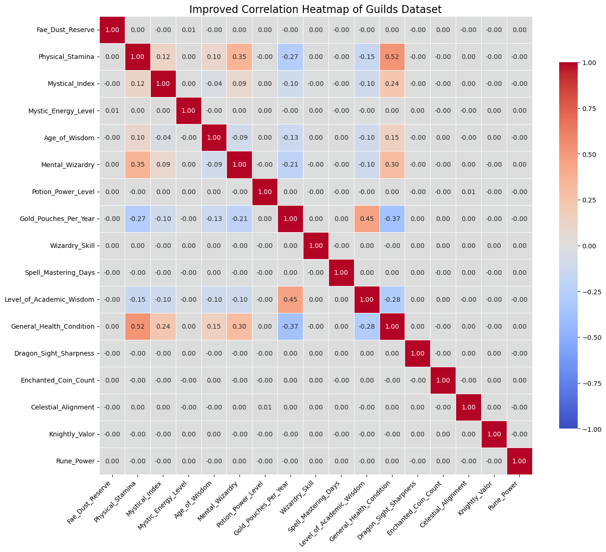
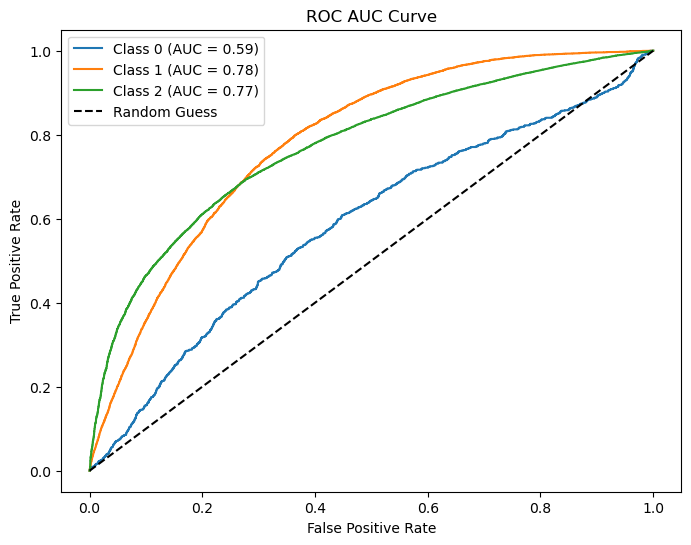
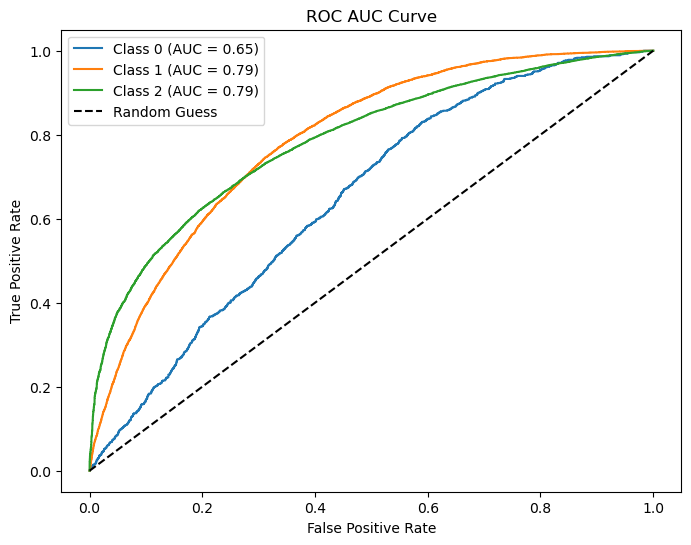
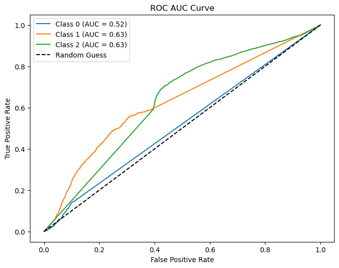

# Predicting Guild Memberships 

## Team Members:

[Giulia Castelli] (Student ID: [300691])
[Francesca Peppoloni]
[Anna Granzotto]

## [Section 1] Introduction

This project focuses on **predicting guild memberships within the Kingdom of Marendor**, a fictional world where scholars possess unique combinations of magical and physical attributes. The dataset comprises **31 features**, combining **both categorical and numerical features**. **Guild membership** represents the **target variable** for classification.

The primary objective is to build machine learning models to accurately **classify scholars into their respective guilds based on their attributes**. This involves extensive data preprocessing, including handling missing values, encoding categorical features, and robustly scaling numerical features to address outliers. We further explore the efficacy of three machine learning models, which are **Logistic Regression**, **Random Forest** and **CART Decision Trees**, to evaluate and optimize classification performance.

By applying advanced optimization strategies such as hyperparameter tuning and cross-validation, the project aims to **identify the most effective model** for this classification task. Insights gained from this analysis are expected to enhance our understanding of the factors influencing guild memberships and contribute to the development of interpretable and robust classification systems.

---

## [Section 2] Methods

### **1. EDA**

#### **Python libraries for analysis and visualization:**
- Pandas
- NumPy
- Matplotlib
- Seaborn
- Missingno
- Scikit-learn

**Exploratory Data Analysis** (**EDA**) helps us to understand, clean, and gain insights from our 
dataset, preparing it for machine learning models. EDA process steps are:
1. Understand Column Meanings
2. Check Data Integrity
3. Visualize Distributions
4. Correlation Heatmap

#### **1.1 Understand Column Meanings**
We used a dataset named **guilds.csv**, which contains **253,680 rows** and **31 columns**, describing various magical and physical attributes of scholars in the Kingdom of Marendor. The data spans a mix of numerical and categorical variables that offer insights into the factors influencing guild memberships.

**Types of Data:**

- **Numerical Columns:** Examples include Fae_Dust_Reserve, Physical_Stamina, and Mystical_Index.
- **Categorical Columns:** Examples include Healer_consultation_Presence and Bolt_of_doom_Presence.
- **Target Variable:** Guild_Membership such as Master_Guild, Apprentice_Guild or No_Guild.
- **Data Types:** While most columns are numerical, some categorical features are binary.

#### **1.2 Check Data Integrity**

**Handling Missing Values:**
We identified missing data using visualizations: **missing data matrix**

**Types of Missingness:**
The patterns and correlations observed suggest that most of the missingness in the dataset can be explained by relationships with other observed variables, classifying it primarily as **`Missing at Random`** (**MAR**). 

#### **1.3 Correlation Heatmap**

--- 

### **2. Preprocessing the Dataset**
 
#### **2.1 Handling Missing Data**
We used two different startegies to handles missing values (**NaN**):

a) **Drop Missing Values in the Target**:
- Rows with missing values in the **Guild_Membership** column were removed, ensuring the dataset was valid for supervised learning tasks.

b) **Imputation for Features**:

- **Numerical Features**: Missing values were replaced with the **median** to handle skewness and reduce the impact of 
outliers.
- **Categorical Features**: Missing values were replaced with the **most frequent value**, preserving categorical
  integrity.

#### **2.2 Encoding Categorical Features**
- **One-Hot Encoding**: it was applied to categorical features such as Healer_consultation_Presence, creating binary columns for each category.
- **Label Encoding for Target**: Guild_Membership was encoded as integers: Master Guild (2), Apprentice Guild (1) and No Guild (0).

#### **2.3 Outlier Treatment**
Instead of removing outliers, we used **Robust Scaling** to reduce their influence while preserving critical information.

- **Robust Scaling**: it scaled features by subtracting the median and dividing by the interquartile range (IQR), making sure that the outliers had minimal impact on scaled values.

---

### **3. Defining the problem type: Regression, Classification or Clustering**

Based on the dataset, this is a **multi-class classification problem** because the target variable `Guild_Membership` consists of discrete categories representing the guild each scholar belongs to ("Master Guild", "Apprentice Guild" and "No Guild"). The objective is to predict which guild each scholar will be assigned to based on their attributes.  

---

### **4. Algorithms**

We chose three algorithms based on their characteristics for the Guild dataset:

**Logistic Regression**

Logistic Regression because it is simple and interpretable, making it suitable for understanding relationships between features and the target. It is also computationally efficient, even with large datasets. However, it assumes linearity between features, which may not hold true for complex datasets like this one. Logistic Regression struggles with imbalanced data, often predicting the majority class, and has limited ability to capture non-linear patterns unless features are transformed or interactions are explicitly modeled.

**Random Forest**

Random Forest is an ensemble method that builds multiple decision trees on bootstrapped samples and combines their predictions to reduce overfitting. It effectively handles non-linearity, provides feature importance metrics and is robust to imbalanced datasets. However, it can be computationally intensive, memory-heavy for large datasets and requires careful hyperparameter tuning for optimal performance.

**CART Decision Trees**

CART Trees is a model that splits the dataset into subsets based on feature values, recursively partitioning until a stopping criterion is met. It is easy to visualize, interpret, and explain, captures non-linear relationships and requires minimal preprocessing for both numerical and categorical data. However, it is highly prone to overfitting without regularization and it is sensitive to small changes in the dataset.

#### **4.1 Training of the models**

a)  The dataset was split into **training**, **validation**, and **test sets** using **stratified sampling** to preserve class distribution across all subsets. This approach ensures consistent proportions of the target variable, allowing for reliable model training, hyperparameter tuning, and evaluation. The same splitting method was applied to all models to ensure comparability.

b)  The models were trained on the training set using **default hyperparameters** and evaluated on the validation set, with metrics such as **precision**, **recall**, **F1-score** and a **confusion matrix** calculated to evaluate performance.

c)  We used **cross-validation** with **GridSearchCV** to identify the **best hyperparameters** for the models by testing various combinations of parameters. This approach ensures the models are optimized for performance while addressing issues like class imbalance and overfitting. The best hyperparameters and their cross-validation accuracy were extracted to fine-tune the model. 

---

## [Section 3] Experimental Design

#### **Main Purpose**
The primary purpose of the experiments was to improve the performance of different machine learning models in predicting guild memberships from the dataset, ensuring the models were appropriately tuned and capable of handling the dataset’s characteristics, such as class imbalance and feature interactions.

#### **Evaluation Metrics**

- **Accuracy:** It was used to evaluate overall correctness but noted as less effective for imbalanced datasets.

- **F1 Score:** It is a balanced metric accounting for precision and recall, especially useful for imbalanced classes.

- **Precision and Recall:** To understand the ability to predict minority classes effectively.

- **ROC-AUC:** To assess the model’s ability to distinguish between classes across thresholds.

- **Confusion Matrix:**  To visualize class-specific performance and errors.

This experimental setup validated each model's contribution by comparing their ability to classify guild memberships, focusing on both overall performance and handling imbalanced classes. 

---

## [Section 4] Results

#### **Main Findings**

**Logistic Regression:**

The Logistic Regression model showed an improvement in accuracy from 57% on the training set to 67% on the test set. However, it struggled to generalize for Class 0, with a significant drop in recall from 44% to 14%. In contrast, Class 1 recall improved from 39% to 62%, while Class 2 maintained high performance with a stable precision of 93% and an increase in recall from 61% to 69%. The weighted averages improved due to better performance on Class 2, and the Test ROC AUC score of 0.71 indicates reasonable overall discrimination, despite challenges with minority classes.

**Random Forest:**

The Random Forest model demonstrated consistent performance across the training and test sets, with an accuracy of 67%. Class 0 remained challenging, with low recall improving marginally from 5% to 7%. Class 1 recall remained high at 71%, with stable precision around 29%, while Class 2 retained high precision (94%) but experienced a slight drop in recall (from 68% to 67%). The weighted averages reflected balanced performance, and the Test ROC AUC of 0.74 confirmed strong discrimination, particularly for the majority class, showing the model's robustness and generalization.

**CART Decision Trees:**

The CART model faced generalization challenges, with accuracy dropping slightly from 68% on the training set to 66% on the test set. For Class 0, recall improved modestly from 7% to 11%, but overall precision and F1-scores remained poor. Class 1 showed slight improvements in recall (from 42% to 44%) but stable precision, while Class 2 experienced a minor decrease in recall (from 73% to 71%) but maintained high precision (90%). The Test ROC AUC of 0.59 highlighted limited class separability, especially for minority classes, underscoring the need for further refinement.

#### **ROC-AUC curves**
**Logistic Regression:**

**Random Forest:**

**CART Decision Trees:**

---

## [Section 5] Conclusions

#### **Conclusion**

This project revealed that ensemble methods like **Random Forest** are highly effective for handling complex datasets with feature interactions and imbalanced class distributions. Random Forest outperformed Logistic Regression and CART Decision Trees, showing consistent accuracy and strong recall for majority and minority classes. The results highlight the model's robustness and its ability to generalize effectively.

#### **Future Work**

While the results are promising, some limitations remain: the models struggled with the minority class (Class 0), meaning that there is still room for improvement in balancing class predictions. Additionally, incorporating feature engineering and external datasets could enhance the model's predictive capabilities. Lastly, interpretability techniques, could be applied to better understand feature importance and decision-making processes within the models.

